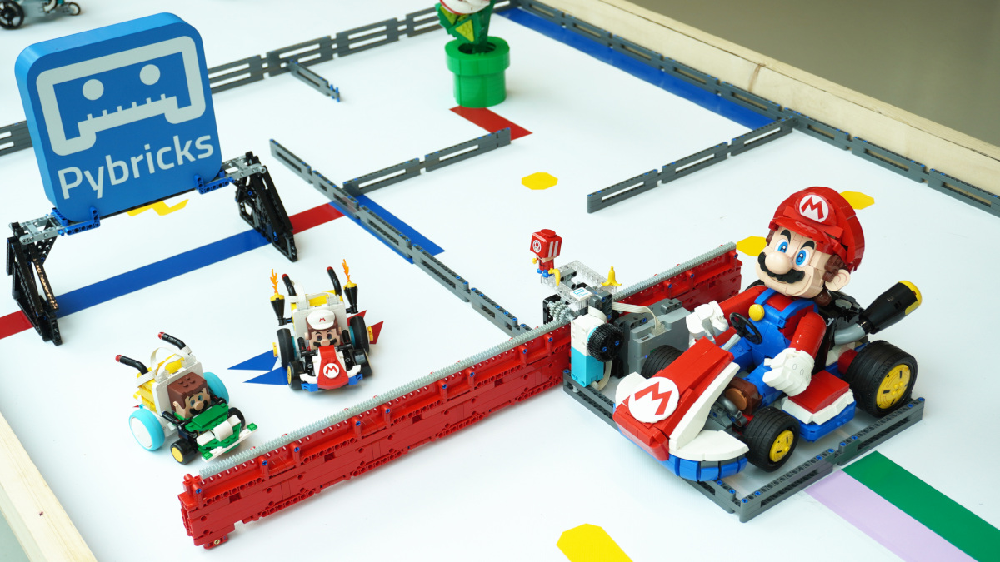

# LEGO® Mario Kart



Watch the [video here][0].

# How does it work?

[Pybricks][1] can run on any re-programmable LEGO hub. Hubs that run Pybricks can communicate by broadcasting over BLE.

A hub running Pybricks can also connect to one other LEGO hub with stock firmware using the [LEGO Wireless Protocol V3 (LWP3)][2]. This includes the LEGO Mario hubs. This lets the hub running Pybricks read the RGB color values measured by Mario.

Putting it all together, the communication scheme is as follows. The SPIKE Prime Hub essentially just serves as a bridge to Mario since each hub can have only one LWP3 connection. Since it's in the loop anyway, we also use it as a display for the lap counter and to visually show the user which color Mario sees.

This repository contains the code for both the SPIKE Prime Hub and the kart built with SPIKE Essential.


```

                            RGB values              
                            (LWP3)                  
          SPIKE Prime    ◄───────────   Mario Hub   
              ▲                                     
              │                                     
              │                                     
BLE Pybricks  │                                     
broadcasting  │                                     
              │                                     
              │             Button ID               
              ▼             (LWP3)                  
         SPIKE Essential ◄───────────   Train remote
              │                                     
              │                                     
              │                                     
              │                                     
              └─►  Drive Motors                     
```


# Alternate materials.

You don't need the SPIKE Prime Hub or the SPIKE Essential Hub. You could also use the Technic Hub, City Hub, or MINDSTORMS Robot Inventor Hub. The main issue is the form factor. You can use the bigger hubs if you don't mind building a slightly bigger kart.

# Instructions

- Build a kart with SPIKE Essential with two motors.
- Build a track with color markers and obstacles.
- [Install the latest nightly Pybricks firmware][3] on both the SPIKE Prime Hub and the SPIKE Essential Hub.
- [Upload][4] all `.py` files in this repo to Pybricks Code.
- Run `prime.py` on the SPIKE Prime Hub.
- Run `kart.py` on the SPIKE Essential Hub.
- Turn on the train remote.
- Turn on Mario and press the Bluetooth button to enter connect mode.
- Play!

[0]: https://www.youtube.com/watch?v=A0NyhdayHJs
[1]: https://pybricks.com/
[2]: https://lego.github.io/lego-ble-wireless-protocol-docs/
[3]: https://pybricks.com/learn/getting-started/install-pybricks/#trying-the-nightly-version-optional
[4]: https://pybricks.com/learn/getting-started/pybricks-environment/#managing-program-files

-------

LEGO® is a trademark of the LEGO Group of companies which does not sponsor, authorize or endorse this site. Nintendo doesn't, either.

